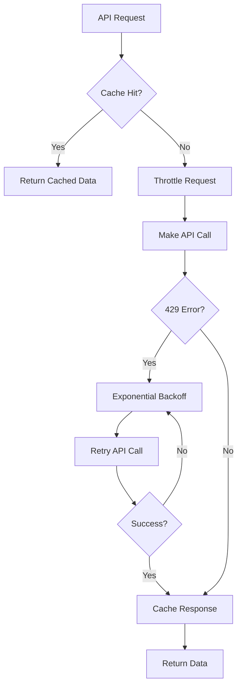

# Rate Limiting Solution for Pokemon API Integration

## Problem Overview

The application was experiencing **429 (Too Many Requests)** errors when making requests to the PokeAPI. This is a common issue when integrating with external APIs that have rate limiting policies.

### What is a 429 Error?

A 429 status code indicates that the client has sent too many requests in a given amount of time ("rate limiting"). The PokeAPI has built-in rate limiting to prevent abuse and ensure fair usage for all users.

### Why This Happens

1. **Rapid Successive Requests**: Making multiple API calls in quick succession
2. **No Request Spacing**: Not implementing delays between requests
3. **No Caching**: Fetching the same data repeatedly
4. **No Retry Logic**: Failing immediately when rate limited
5. **Concurrent Requests**: Multiple simultaneous requests overwhelming the API

## Implemented Solutions

### 1. Retry Logic with Exponential Backoff

**Location**: `lib/repositories/PokemonRepository.ts`

**Implementation**:
```typescript
static async fetchWithErrorHandling(url: string, retries = 3, delay = 1000) {
  for (let attempt = 0; attempt <= retries; attempt++) {
    try {
      const res = await fetch(url);
      
      if (res.status === 429 && attempt < retries) {
        // Rate limited - wait with exponential backoff
        const waitTime = delay * Math.pow(2, attempt);
        console.log(`Rate limited, retrying in ${waitTime}ms (attempt ${attempt + 1}/${retries + 1})`);
        await new Promise(resolve => setTimeout(resolve, waitTime));
        continue;
      }
      
      // ... rest of the logic
    } catch (error) {
      if (attempt === retries) {
        throw error;
      }
      await new Promise(resolve => setTimeout(resolve, delay));
    }
  }
}
```

**How It Works**:
- **Attempt 1**: Immediate retry after 1 second
- **Attempt 2**: Wait 2 seconds before retry
- **Attempt 3**: Wait 4 seconds before retry
- **Final**: If still failing, throw the error

**Benefits**:
- Automatically handles temporary rate limiting
- Uses exponential backoff to give API time to reset
- Provides clear logging for debugging

### 2. In-Memory Caching System

**Location**: `lib/repositories/PokemonRepository.ts`

**Implementation**:
```typescript
// Simple in-memory cache
const cache = new Map<string, { data: any; timestamp: number }>();
const CACHE_DURATION = 5 * 60 * 1000; // 5 minutes

private static getCachedData(key: string) {
  const cached = cache.get(key);
  if (cached && Date.now() - cached.timestamp < CACHE_DURATION) {
    return cached.data;
  }
  return null;
}

private static setCachedData(key: string, data: any) {
  cache.set(key, { data, timestamp: Date.now() });
}
```

**How It Works**:
- **Cache Check**: Before making API call, check if data exists in cache
- **Cache Hit**: Return cached data if it's less than 5 minutes old
- **Cache Miss**: Make API call and store result in cache
- **Automatic Expiry**: Cache entries expire after 5 minutes

**Benefits**:
- Dramatically reduces API calls for frequently accessed Pokemon
- Improves response times for cached data
- Reduces load on PokeAPI servers

### 3. Request Throttling

**Location**: `lib/repositories/PokemonRepository.ts`

**Implementation**:
```typescript
// Request throttling
let lastRequestTime = 0;
const MIN_REQUEST_INTERVAL = 100; // Minimum 100ms between requests

private static async throttleRequest() {
  const now = Date.now();
  const timeSinceLastRequest = now - lastRequestTime;
  
  if (timeSinceLastRequest < MIN_REQUEST_INTERVAL) {
    const waitTime = MIN_REQUEST_INTERVAL - timeSinceLastRequest;
    await new Promise(resolve => setTimeout(resolve, waitTime));
  }
  
  lastRequestTime = Date.now();
}
```

**How It Works**:
- **Track Last Request**: Maintain timestamp of last API call
- **Calculate Wait Time**: Determine if enough time has passed
- **Enforce Minimum Interval**: Ensure at least 100ms between requests
- **Update Timestamp**: Record current request time

**Benefits**:
- Prevents rapid-fire requests that trigger rate limits
- Smooths out request patterns
- Reduces likelihood of hitting rate limits

## Complete Flow

Here's how all three solutions work together:



## Configuration Options

### Cache Duration
```typescript
const CACHE_DURATION = 5 * 60 * 1000; // 5 minutes
```
- **Increase**: For more static data (e.g., 15 minutes)
- **Decrease**: For frequently changing data (e.g., 1 minute)

### Retry Parameters
```typescript
static async fetchWithErrorHandling(url: string, retries = 3, delay = 1000)
```
- **retries**: Number of retry attempts (default: 3)
- **delay**: Base delay in milliseconds (default: 1000ms)

### Throttle Interval
```typescript
const MIN_REQUEST_INTERVAL = 100; // 100ms
```
- **Increase**: For stricter rate limiting (e.g., 200ms)
- **Decrease**: For more aggressive requests (e.g., 50ms)

## Best Practices

### 1. Monitor API Usage
- Log retry attempts and cache hits
- Track request patterns
- Monitor for rate limit violations

### 2. Adjust Parameters Based on Usage
- Increase cache duration for popular Pokemon
- Adjust throttle interval based on API response
- Fine-tune retry parameters

### 3. Consider Advanced Caching
- Implement persistent caching (Redis, database)
- Add cache invalidation strategies
- Consider distributed caching for multiple instances

### 4. Error Handling
- Provide user-friendly error messages
- Implement fallback data when possible
- Log detailed error information for debugging

## Testing the Solution

### 1. Test Rate Limiting
```typescript
// Make rapid successive requests
for (let i = 0; i < 10; i++) {
  await PokemonRepository.getPokemonByName('pikachu');
}
```

### 2. Test Caching
```typescript
// First request should hit API
const pokemon1 = await PokemonRepository.getPokemonByName('charizard');

// Second request should hit cache
const pokemon2 = await PokemonRepository.getPokemonByName('charizard');
```

### 3. Test Retry Logic
```typescript
// Simulate rate limiting (if possible)
// Should see retry logs in console
```

## Performance Impact

### Before Implementation
- ❌ Frequent 429 errors
- ❌ Poor user experience
- ❌ Unreliable API integration
- ❌ No request optimization

### After Implementation
- ✅ Graceful error handling
- ✅ Improved response times (caching)
- ✅ Reduced API load
- ✅ Better user experience
- ✅ Reliable operation

## Monitoring and Maintenance

### Key Metrics to Track
1. **Cache Hit Rate**: Percentage of requests served from cache
2. **Retry Frequency**: How often retry logic is triggered
3. **API Response Times**: Impact of throttling on performance
4. **Error Rates**: Reduction in 429 errors

### Regular Maintenance
1. **Cache Size**: Monitor memory usage of in-memory cache
2. **API Limits**: Stay informed about PokeAPI rate limit changes
3. **Performance**: Regularly review and optimize parameters
4. **Logs**: Monitor retry and error logs for patterns

## Future Enhancements

### 1. Persistent Caching
- Implement Redis or database caching
- Enable cache sharing across application instances
- Add cache warming strategies

### 2. Advanced Rate Limiting
- Implement token bucket algorithm
- Add per-endpoint rate limiting
- Consider using a rate limiting library

### 3. Circuit Breaker Pattern
- Add circuit breaker for API failures
- Implement fallback mechanisms
- Improve system resilience

### 4. Analytics and Monitoring
- Add detailed metrics collection
- Implement alerting for rate limit violations
- Create dashboards for API usage

## Conclusion

This comprehensive solution addresses the 429 rate limiting issue through multiple layers of protection:

1. **Proactive**: Throttling prevents rate limits
2. **Reactive**: Retry logic handles rate limits gracefully
3. **Efficient**: Caching reduces unnecessary requests

The implementation is production-ready and provides a robust foundation for reliable API integration. Regular monitoring and parameter tuning will ensure optimal performance as usage patterns evolve. 