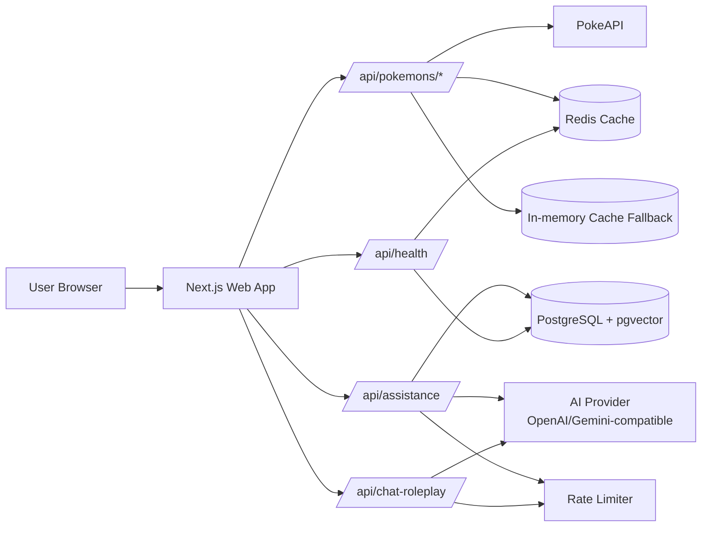
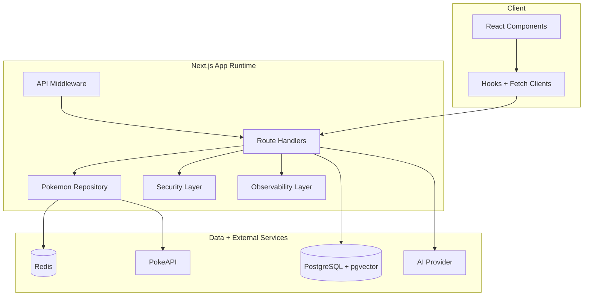

# Architecture Overview

This project is a full-stack Next.js app that combines frontend interaction patterns (search, detail exploration, AI chat) with production-style API hardening, layered caching, and operational health checks.

## System Context

## Runtime Containers

## Frontend Flow

1. User interacts with the homepage, Pokedex route, Pokemon detail pages, type filter pages, random Pokemon flow, and team builder.
2. Components call internal API routes instead of external APIs directly.
3. Chat features send prompt context to `/api/assistance` or `/api/chat-roleplay`.
4. UI renders typed success/error states using the unified API response contract.

## API Routes And Responsibilities

- `GET /api/pokemons/get-all`: paginated catalog data.
- `GET /api/pokemons/first-page` and `GET /api/pokemons/last-page`: pagination helpers.
- `GET /api/pokemons/details/*`: Pokemon detail data.
- `GET /api/pokemons/enriched/*`: enriched Pokemon data backed by Redis plus fallback cache.
- `GET /api/pokemons/evolution-chain/*`: evolution chain data.
- `GET /api/pokemons/random`: random Pokemon selection.
- `GET /api/pokemons/get-by-type/*`: type-filtered Pokemon data.
- `GET /api/pokemons/custom-page/*`: custom page data for the Pokedex experience.
- `POST /api/assistance`: retrieval-augmented assistant (pgvector + provider abstraction).
- `POST /api/chat-roleplay`: streaming roleplay chat endpoint.
- `GET /api/health`: app/database/redis dependency health and status grading.
- `POST /api/internal/rate-limit`: internal shared rate-limit endpoint.

## Caching And Fallback Strategy

- Primary cache path uses Redis when available.
- Route handlers and repository methods tolerate Redis outages without hard failure.
- Bounded in-memory fallback cache preserves baseline responsiveness.
- Enriched endpoint supports stale-while-revalidate behavior to reduce latency spikes.

## Observability

- Structured event logging and route timing are emitted via `lib/observability.ts`.
- StatsD-compatible metric export is available through environment toggles.
- Health endpoint reports `ok`, `degraded`, or `fail` based on required vs optional dependency status.

## Security And Rate Limits

- Middleware enforces API route protections and security headers.
- Costly routes require origin presence and allowed-origin checks.
- Per-client rate limiting is applied with Redis-first and local fallback behavior.
- Responses include explicit rate-limit headers to support clients and diagnostics.

## Tradeoffs And Next Milestones

- Tradeoff: Redis is optional for resiliency; this improves uptime but can reduce cache hit quality during outages.
- Tradeoff: provider abstraction increases flexibility but adds configuration surface area.
- Next milestone: add visual tracing dashboard examples (latency and error budgets).
- Next milestone: expand E2E coverage across chat, team-builder, and Pokedex workflows.

